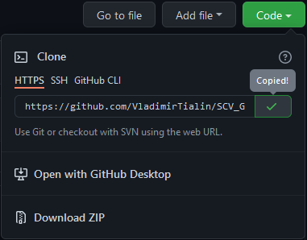

# Работа с Git
## 1.Проверка наличия установленного Git.
В терминале выполнить команду `git version`.
Если Git установлен , появится сообщение с информацией версии файла. Иначе будет сообщение об ошибке.
## 2. Установка Git
Загружаем последнюю версию [Git](Githttps://git-scm.com/downloads)
 с официального сайта.
 
Устанавливаем настройки по умолчанию.
## 3. Настройка Git
При первом использовании Git необходимо представиться.

Для этого нужно ввести две команды:
```
- git config --global user.name "Ваше имя"
- git config --global user.email "почта@example.com"
```
## 4. Инициализация репозитория
Получить репозиторий можно двумя способами:
* В терминале вы переходите к папке, в которой хотим создавать репозиторий.
* Выполняем команду `git init`. В исходной папке появиться скрытая папка **_.git_**,  содержащая все необходимые файлы репозитория - структуру Git - репозитория.
* Клонировать существующий репозиторий Git из любого места.

Сделать это можно командой:
```
git clone <адрес репозитория>
```
## 5. Запись изменений в репозиторий
Чтобы определить соcтояние файлов в репозитории, необходимо выполнить команду:
```
git status
```
Для проверки статуса в сокращенном виде, можно использовать следующую запись:
```
git status -s
git status --short
```
Данная команда показывает следующие состояния (при использовании **Git Bash**):
* В терминале будет выведено сообщение *`nothing added to commit but untracked files present`* - в репозитории отсутствуют отслеживаемые файлы.
* В терминале, красным цветом выведено сообщение **`modified:   HomeWork1.md`** - отслеживаемый файл был изменен, но не записан в репозиторий.
* В терминале, зеленым цветом выведено сообщение *`modified:   HomeWork1.md`* - отслеживаемый файл изменен и записан в репозиторий, но не зафиксирован.
## 6. Отслеживание файлов
Чтобы начать отслеживать файл репозитория введите команду:
```
git add <название файла.расширение файла>
```
Например:
```
git add HomeWork1.md
```

При работе с командой `git add` возможно использовать следующие сокращения:
* Для обновления отслеживаемых файлов:
```
git add -u
```
* Для добавления изменений из всех отслеживаемых и неотслеживаемых файлов:
```
git add -A
git add --all
```
## 7. Совершение коммита
`Commit` - означет фиксация. **`Git commit`** - это команда означает фиксацию изменений файла и присвоение ему короткого имени (метки, коммита).
Существует несколько ключей использования данной команды:
1. Задаем произвольный комментарий.
```
git commit -m "комментарий"
```
2. Отслеживаем файл и задаем произвольный комментарий. При этом мы пропускаем команду `git add`, .т.к. данная команда выполняет 2 действия одновременно.
```
git commit -am "комментарий"
```
## 8. Получение информации о истории коммитов 
Для получения отслеживания истории изменения файлов и коммитов используется команда `git log`
* Для просмотра изменения файлов необходимо ввести в терминале:
```
git log
```
Если изменения не помещаются в терминале жмите клавишу *_ENTER_*, как только дойдете по первого коммита, появиться надпись **END**.

Для выхода из режима просмотра истории изменения файлов и коммитов нажмите кнопку **Q**.
* Для просмотра сокращенной информации о коммитах используется следующая команда:
```
git log --oneline
```
При этом отображаются хеш-коды коммитов в сокращенной виде и сами коммиты.
* Для отображения текущей ветки и истории слияния используют следующую команду:
```
git log --graph
```
## 10. Сравнение с последним коммитом
Для вывода изменений в файлах по сравнению с последним коммитом используеся команда:
```
git diff
```
Для вывода изменений внесенных в файл и зафиксированных командой _`git add`_ необходимо в терминале ввести команду:
```
git diff -c 
```
либо 
```
git diff --cached 
```
Если информация не помещается в терминале жмите клавишу *_ENTER_* до тех пор, пока не увидете надпись **END**.

Для выхода из режима нажмите кнопку **Q**.
## 11. Перемещение между сохранениями (коммитами)
1. Переход между сохранениями или коммитами осуществляетя по следующей команде:
```
git checkout <хеш-код>
```
Например:
```
git checkout 3bcc8e5
```
где _**`3bcc8e5`**_ - хеш-код сохраненного коммита.

Данный вид перехода используется только для просмотра. ***Для дальнейшей корректной работы, необходимо вернуться к последнему коммиту.***

2. Переход между ветками осуществляется комадной:
```
git checkout <имя ветки>
```
Например:
```
git branch clonemaster
git checkout clonemaster
git branch
```
* Первая строка кода создает ветру ***`clonemaster`***;
* Вторая строка кода делает активной ветку ***`clonemaster`***;
* Третья строка кода показывает какая ветка в данный момент активна.
## 12. Игнорирование файлов и папок
Для того, чтобы определить, какие файлы и папки не нужно добавлять в репозиторий используется файл **`.gitignore`**.
Например, создаем файл игнорирования и ~добавляем~`исключаем из репозитория файлы с расширение *png* и *jpeg*
```
# Исключаем все файлы с расширение png и jpeg.
*.png
*.jpeg
```
Знак **`#`** обозначает текст комментария.
## 13. Ветвление
Для создания новой ветки используется команда:
```
git branch <имя ветки>
```
Например, создадим новую ветку ***newinstruction***:
```
git branch newinstruction
```
 Ветвление необходимо для работы файлами в отдельной ветки, сохраняя при этом исходное состояние файла до его слияния.
 
 Чтобы отобразить созданные ветки, используется команда:
 ```
git branch
 ```
 Для перехода к вновь созданной ветке необходимо выполнить команду:
 ```
git checkout newinstruction
 ```
 После выполнения данной команды, наша ветка становиться *активной*, и мы можем приступить к работе с файлами, при этом, ***`файл в исходной ветке не будет изменен до тех пор, пока мы не произведем слияние веток`***

Для вывода списка веток и дополнительной информации по отслеживанию файлов, используется команда:
```
git branch -vv
```
Например, создадим новую ветку ***newinstruction*** и перейдем к редактированию файлов в ней:
## 14. Слияние веток
Для слияния веток  и внесения изменений в наш основной файл используется команда:
```
git merge <имя ветки>
```
Например, переходим в основную ветку ***`master`***, и производим слияние текущей ветки с измененным файлом ***`HomeWork2`***:
```
git checkout master
git merge HomeWork2
```
 ## 15. Разрешение конфликтов
Конфликты возникают при слиянии двух веток в одну и когда в этих ветках была изменена одна и та же строка (строки) файла.
Разрешение конфликта возможно путем следующих методов:

| № | Methods | Translation |
| --- | ---| --- |
| 1 | accept current change | принять текущее изменение |
| 2 | accept incoming change | принять входящие изменения |
| 3 | accept both chang | принять оба изменения |
| 4 | compare changes | сравнить изменения|
## 16. Удаление ветки
Для удаления ветки необходимо использовать следующую команду:
```
git branch -d <имя ветки>
git branch --delete <имя ветки>
```
Например, для удаления ветки `HomeWork2`, необходимо убедиться, что мы находимя в основной ветке проекта, в нашем случае в ветке `master`:
```
git branch
git branch -d HomeWork2
```
## 17. Подготовка к работе с удаленным репозиторием
**`Удаленный репозиторий`** - это проект, который располагается не на Вашем компьютере, а в сети интернет, либо на другом компьютере, к которому имеется доступ по средствам локальной сети, на сервере и тд.

В качестве удаленного репозитория можно использовать сайт [GitHub](https://github.com).

Для работы с удаленными репозиториями необходимо пройти регистрацию. После чего сайт предоставляет доступ к работе с удаленными репозиториями.
Для работы с удаленными репозиториями используют базовые команды:

| № | Cod | Translation |
| --- | ---| --- |
| 1 | `git clone` | создание копии удаленного репозитория на локальный ПК |
| 2 | `git push` | отправление обновленных коммитов в удаленный репозиторий |
| 3 | `git pull`| извлечение с удаленного репозитория файлов проекта |
| 4 | `git remote add` | добавление проекта на удаленный репозиторий|

Чтобы приступить к работе над каким-либо проектом на ***`GitHub`***, необходимо сначало перейти к репозиторию данного проекта на сайте.

Например, *репозиторий* [Андрея Булгакова](https://github.com/AndreyBulgakov19/SCV_Git_1804).

Для успешного добавления удаленного репозитория на Ваш компьтер необходимо придерживаться следующих действий:
+ После перехода на  страницу разработчика проекта, необходимо в правом верхнем углу выбрать кнопку **`Fork`**, как показано на рисунке ниже.


* Написать ***`имя репозитория`*** и нажать кнопку **Creat Fork**.
После чего, страница сайта обновиться, Вы окажетесь на странице своего аккаунта, где будет отображаться репозиторий добавленного проекта.
+ Для клонирования проекта необходимо нажать на кнопку `Code`.
+ Скопировать в буфер ссылку на репозиторий проекта, как показано на рисунке ниже.


+ Создать рабочую папку.
+ Открыть `Visual Studiо Code`, либо другой редактор открыть рабочую папку.
+ Выполнить комадну:
```
git clone https://github.com/AndreyBulgakov19/SCV_Git_1804
```
Данная команда создаст копию удаленного репозитория.
+ Зайти в рабочую папку командой:
```
cd SCV_Git_1804
```
> Главное не начинат работу в основной ветки проекта, необходимо создать отдельную ветку!!!
+ Просматриваем текущие ветки проекта, создаем новую ветку для работы, переходим в неё и начинаем работу:
```
git branch
git branch NewWorkFiles
git checkout NewWorkFiles
```
## 18. Использование команды Push
**`Git push`** используется для отправки всех обновленных коммитов из локальной ветки, которая хранится в локальной системе, в удаленную ветку.

Чаще всего при работе с `Push`  используются следующие команды:
```
git push
```
* Отправляет определенную ветку на удаленный сервер, включая все последние коммиты и связанные с ними объекты.
```
git push --all
```
*  Отправляет все локальные ветки.
```
git push --delete
```
* Удаление конкретной удаленной ветви.
## 19. Использование команды Fetch и Pull
```
git fetch <имя удаленного репозитория>
```
данная  команда связывается с указанным удалённым проектом и забирает все те данные проекта, которых у вас ещё нет. **Fetch** забирает данные в ваш локальный репозиторий, но не сливает их с какими-либо вашими наработками, и не модифицирует то, над чем вы работаете в данный момент.
Если ветка настроенна на отслеживание удалённой ветки, то можно использовать команду:
```
git pull
```
 В таком случае, данная команда автоматичеси извлекает и затем сливает данные из удалённой ветки в вашу текущую ветку.
## 20. Использование команды Remote
Просмотреть, какие удалённые серверы уже настроены, можно следующей командой:
```
git remote
```
Если вы склонировали ваш репозиторий, у вас должен отобразиться как минимум **`origin`**.

Чтобы добавить новый удалённый репозиторий с определенным именем, необходимо выполнить команду:
```
git remote add name https://github.com/AndreyBulgakov19/SCV_Git_1804
```
где `name` имя-сокращение.
Команда будет выполнена, но система не предоставит никакой обратной связи в окне терминала. 
Для отправления файлов в удаленный репозиторий, необходимо выполнить команду:
```
git push --set-upstream name master
```
В окне терминала отображается количество объектов, отправленных на сервер, и указывается, что ваш локальный репозиторий настроен на отслеживание ветки с именем `master`.
Таким образом, на сайте **GitHub** мы сможем видеть наш репозиторий со всем переданными файлами.
## 21. Осуществляем Pull Request
**`Pull request`** - это запрос к управляющему каким-либо репозиторием (человеку, группе людей или вообще роботу) на применение изменений (из вашего репозитория и/или указанной вами ветки).
Для создания ***`Pull request`*** необходимо:
+ Зайти на [GitHub](https://github.com).
+ Авторизоваться;
+ Найти страницу пользователя, зайти на неё и выбрать нужный проект.
Например, проект [Андрея Булгакова](https://github.com/AndreyBulgakov19/SCV_Git_1804). 
+ сделать **`Fork`** проекта. (см. в главе 17).

После добавления удаленного репозитория к себе на компьютер мы приступаем к его редактированию.
Однако, неоходимо придерживаться следующих основных правил:
>***`Нельзя начинать работать в ветке склонированного проекта, все правки, добавления файлов и папок делаются в отдельносозданной ветке!`***

>***`Нельзя добавлять в папку проекта, скопированного с удаленного репоозитория, свой локальный репозиторий (а именно скрытую папку`*** **.git** ***`), т.к. могут возникнуть ошибки.`***

Для безопасной работы над чужим проектом, создадим отдельную ветку:
```
git branch
git branch NewProject
git checkout NewProject
git branch
```
Рассмотрим 2 способа созданию `Pull request`.